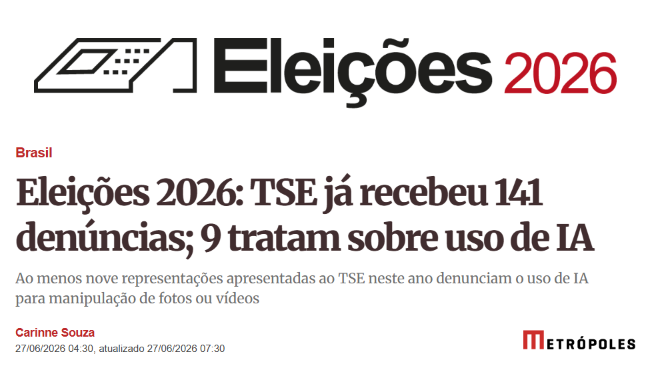
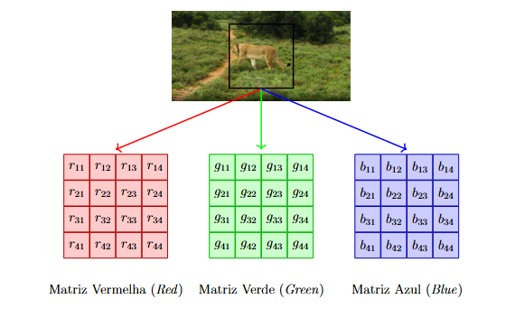
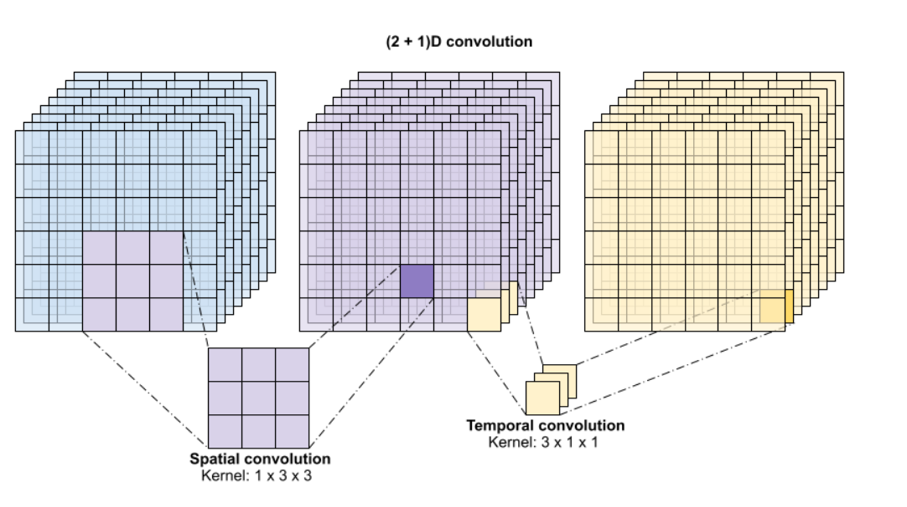
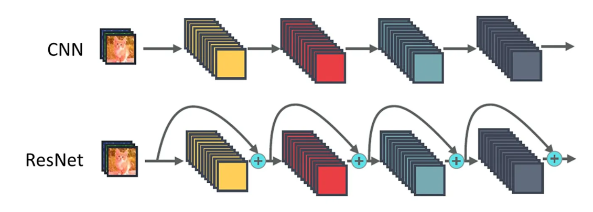
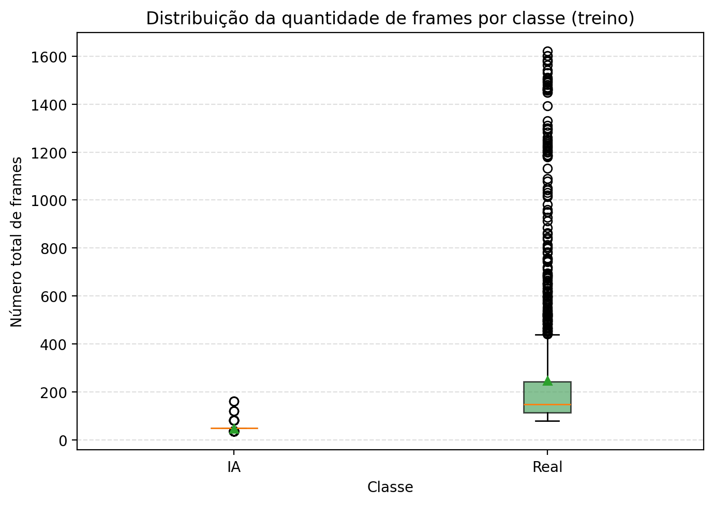
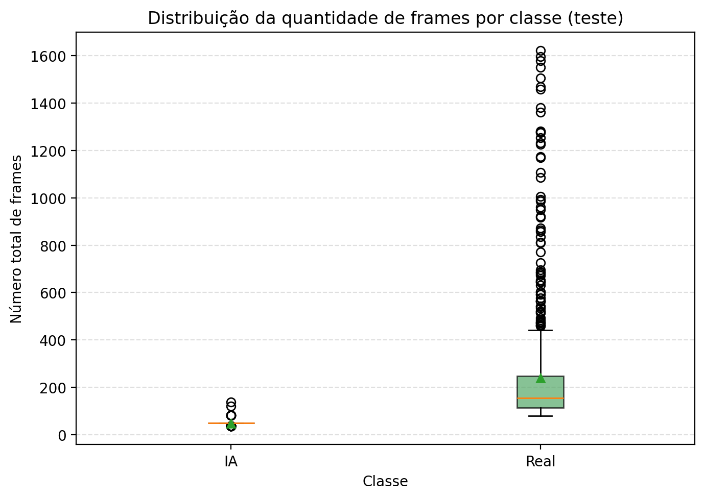
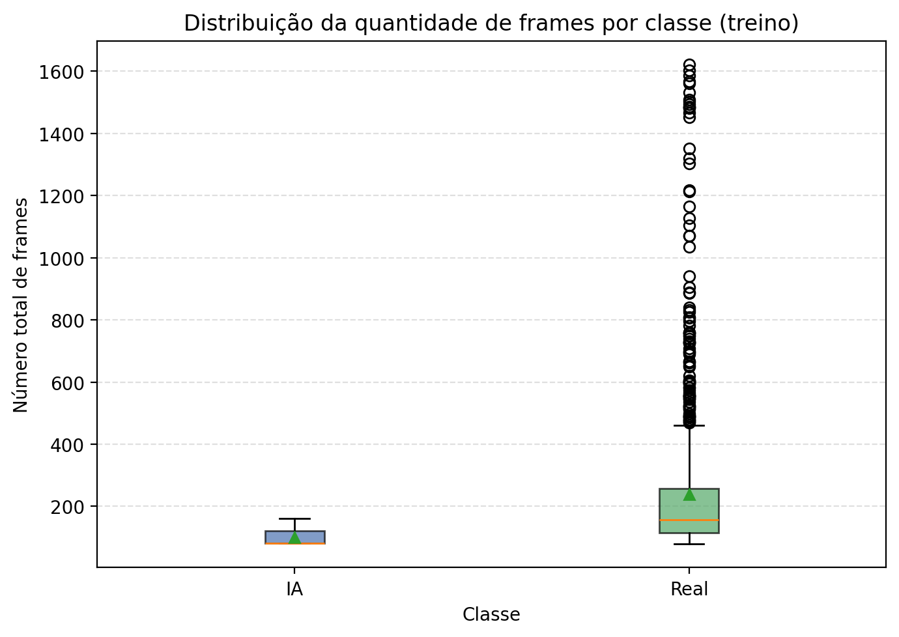
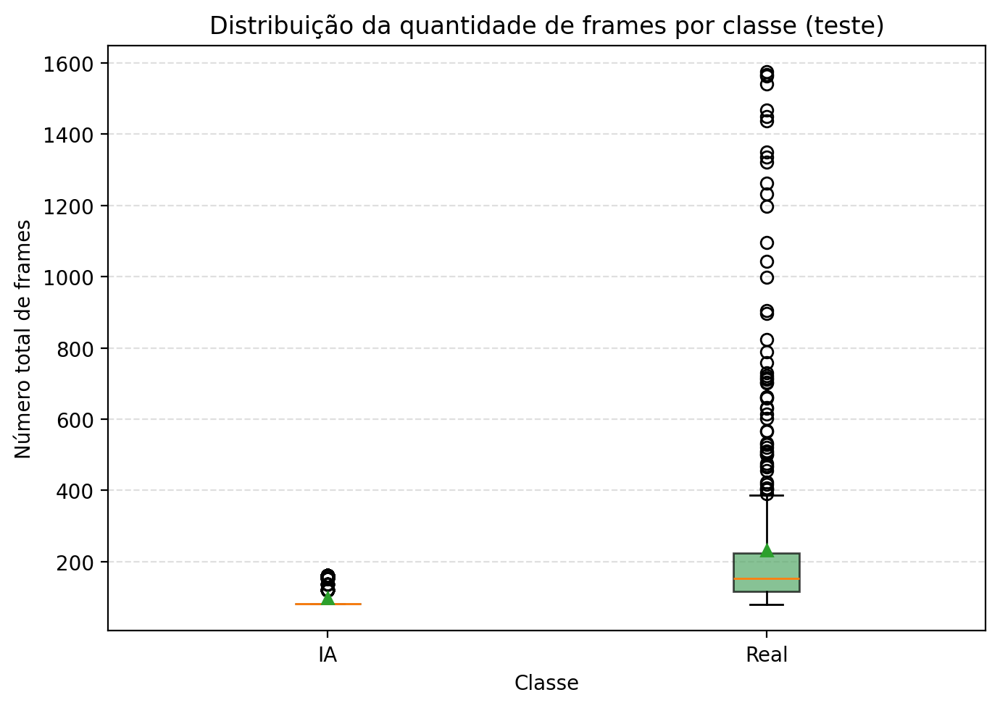

# Redes Convolucionais (2+1)D Aplicadas à Detecção de Vídeos de Inteligência Artificial

**Autor:** Matheus Jun Onishi da Silva  
**Orientador:** Prof. Dr. Douglas Rodrigues Pinto  
**Instituição:** Universidade Federal Fluminense — Departamento de Estatística  
**Curso:** Bacharelado em Estatística  
**Ano:** 2026  

📄 [Monografia completa (PDF)](monografia_exemplo.pdf)

---

## Sumário

1. [Motivação](#-motivação)  
2. [Base de Dados — AIGVDBench](#-base-de-dados--aigvdbench)  
3. [Pré-processamento](#-pré-processamento)  
4. [Arquitetura (2+1)D](#-arquitetura-21d)  
5. [Avaliação Inicial](#-avaliação-inicial)  
6. [Aprendizado por Atalho](#-aprendizado-por-atalho-shortcut-learning)  
7. [Reavaliação com Amostra Filtrada](#-reavaliação-com-amostra-filtrada)  
8. [Conclusões](#-conclusões)  
9. [Como Usar](#-como-usar)  

---

## 🎯 Motivação

Com a popularização de geradores de vídeo por IA — como **Sora, Wan, EasyAnimate, AccVideo e RepVideo** — cresce rapidamente a produção de conteúdo sintético capaz de enganar o olho humano. Vídeos falsos já circulam em contextos de desinformação política, fraude e manipulação de opinião.

<table>
<tr>
<td align="center"><br/><sub>Exemplo de vídeo falso usado em contexto eleitoral</sub></td>
<td align="center"><br/><sub>Vídeo gerado por IA (Metropolis)</sub></td>
<td align="center"><br/><sub>Vídeo de guerra gerado por IA</sub></td>
</tr>
</table>

Estudos mostram que humanos têm grande dificuldade em distinguir vídeos reais de sintéticos. Este trabalho propõe o uso de **redes neurais convolucionais (2+1)D** para automatizar essa tarefa.

---

## 🗄️ Base de Dados — AIGVDBench

| Característica | Valor |
|---|---|
| Total de vídeos | +440.000 |
| Modelos geradores de IA | 31 |
| Vídeos reais (fonte) | OpenVid-HD |
| Armazenamento total | ≈ 378 GB |

**Seleção utilizada neste trabalho:** modelos de 2025 (Open-Sora, RepVideo, AccVideo, EasyAnimate, Wan…), com ~176.000 vídeos (162 mil de IA + 14 mil reais), classificação **binária: IA vs. Real**.

### Exemplos de frames

<table>
<tr>
<td align="center"><br/><sub>Frame de vídeo <b>real</b> (OpenVid-HD)</sub></td>
<td align="center"><br/><sub>Frame de vídeo gerado por <b>IA</b></sub></td>
</tr>
<tr>
<td align="center"><br/><sub>Outro exemplo de frame gerado por IA</sub></td>
<td align="center"><br/><sub>Vídeo sintético circulando como notícia</sub></td>
</tr>
</table>

---

## ⚙️ Pré-processamento

### Frame como Matriz de Valores

Cada frame do vídeo é decomposto em uma **matriz numérica de pixels**. No modo RGB são três canais (vermelho, verde, azul) com valores de 0 a 255; no modo tons de cinza, um único canal de intensidade luminosa.

<p align="center">
  
</p>

### Seleção de Frames

Os vídeos são amostrados com **passo fixo P = 4** segundo a fórmula:

$$L = 1 + (N_{\text{frames}} - 1) \times P$$

Onde `L` é o número mínimo de frames necessários no vídeo e `N_frames` é a quantidade selecionada. Vídeos com menos frames que o necessário recebem **frames vazios** ao final.

### Modos de Redimensionamento

Todos os frames são redimensionados para **112 × 112 px** antes de entrar na rede. Três modos foram implementados:

<table>
<tr>
<td align="center"><br/><sub><b>stretch</b><br/>Redimensiona direto (pode distorcer)</sub></td>
<td align="center"><br/><sub><b>center_crop</b><br/>Corta o quadrado central</sub></td>
<td align="center"><br/><sub><b>pad</b><br/>Preserva proporção com padding preto</sub></td>
</tr>
</table>

O modo **stretch** foi utilizado nos experimentos. Abaixo, o mesmo frame em **RGB** e **tons de cinza**:

<table>
<tr>
<td align="center"><br/><sub>Frame original (RGB)</sub></td>
<td align="center"><br/><sub>Frame em tons de cinza</sub></td>
</tr>
</table>

### Amostra Inicial (balanceada — 50% IA / 50% Real)

| Conjunto | IA | Real | Total |
|---|---|---|---|
| Treino | 1.500 | 1.500 | 3.000 |
| Validação | 500 | 500 | 1.000 |
| Teste | 700 | 700 | 1.400 |
| **Total** | **2.700** | **2.700** | **5.400** |

---

## 🧠 Arquitetura (2+1)D

A arquitetura (2+1)D **fatora a convolução 3D** em duas etapas sequenciais:

1. **Convolução Espacial 2D** — captura padrões dentro de cada frame (bordas, texturas, formas)
2. **Convolução Temporal 1D** — captura a evolução dessas características ao longo do tempo (movimento)

<p align="center">
  
  <br/><sub>Fatoração da convolução (2+1)D: espacial 2D + temporal 1D</sub>
</p>

Essa fatoração reduz o custo computacional em relação às CNNs 3D tradicionais, mantendo a capacidade de capturar padrões espaço-temporais.

### Blocos Residuais

O modelo emprega **conexões residuais** (*skip connections*) para estabilizar o treinamento em redes mais profundas:

<p align="center">
  
  <br/><sub>Bloco residual: a entrada é somada à saída da convolução</sub>
</p>

### Fluxo Completo da Rede

```
Entrada  (N × 112 × 112 × C)        C = 3 (RGB) ou 1 (cinza)
    │
Conv2Plus1D  16 filtros · kernel 3×7×7
BatchNorm + ReLU
    │
ResizeVideo → 56 × 56
Bloco Residual  16 filtros
    │
ResizeVideo → 28 × 28
Bloco Residual  32 filtros
    │
ResizeVideo → 14 × 14
Bloco Residual  64 filtros
    │
ResizeVideo → 7 × 7
Bloco Residual  128 filtros
    │
GlobalAveragePooling3D
Flatten
Dense (num_classes)
    │
Saída: IA  /  Real
```

### Hiperparâmetros de Treinamento

| Parâmetro | Valor |
|---|---|
| N° de frames avaliados | 1 a 15 (30 modelos) |
| Passo entre frames | 4 |
| Resolução dos frames | 112 × 112 px |
| Canais | RGB (3) e Tons de Cinza (1) |
| Épocas | 25 |
| Learning Rate | 0,01 (Adam) |
| Batch Size | 20 |
| Ambiente | Google Colab — GPU T4 |

---

## 📊 Avaliação Inicial

### Resultados por Número de Frames

| N Frames | Treino RGB (%) | Teste RGB (%) | Tempo RGB (min) | Treino Cinza (%) | Teste Cinza (%) | Tempo Cinza (min) |
|:---:|:---:|:---:|:---:|:---:|:---:|:---:|
| 1 | 88,50 | 88,21 | 40,5 | 87,63 | 87,43 | 44,5 |
| 2 | 90,23 | 90,57 | 65,3 | 89,97 | 90,07 | 70,1 |
| 3 | 92,37 | 92,71 | 91,0 | 91,80 | 91,57 | 98,4 |
| 4 | 93,83 | 94,14 | 115,6 | 93,43 | 93,86 | 122,7 |
| 5 | 94,63 | 94,71 | 142,0 | 94,23 | 94,57 | 148,6 |
| 6 | 95,37 | 95,57 | 167,2 | 95,00 | 95,29 | 175,0 |
| 7 | 95,87 | 96,14 | 195,3 | 95,53 | 96,00 | 202,4 |
| 8 | 96,40 | 96,71 | 220,5 | 96,13 | 96,57 | 228,3 |
| 9 | 96,80 | 97,00 | 246,2 | 96,60 | 96,86 | 254,8 |
| 10 | 97,10 | 97,43 | 272,8 | 96,97 | 97,29 | 279,6 |
| 11 | 97,40 | 97,71 | 298,3 | 97,17 | 97,57 | 304,5 |
| 12 | 97,73 | 98,14 | 323,7 | 97,47 | 97,86 | 330,2 |
| 13 | 97,97 | 98,57 | 350,0 | 97,83 | 98,43 | 356,9 |
| **14** | **98,17** | **98,93** | **340,4** | **98,33** | **99,14** | **379,6** |
| **15** | **98,70** | **99,14** | **372,4** | **98,77** | **99,00** | **352,4** |

> Os modelos com **14 e 15 frames** apresentaram os melhores resultados — acurácia de teste acima de 99% em tons de cinza.

---

## 🔍 Aprendizado por Atalho *(Shortcut Learning)*

Antes de concluir que o modelo aprendeu a detectar vídeos de IA pelos padrões visuais de geração, foi realizada uma **análise exploratória da distribuição de frames por classe**.

### Distribuição de Frames — Avaliação Inicial

<table>
<tr>
<td align="center">
  
  <br/><sub>Conjunto de Treino</sub>
</td>
<td align="center">
  
  <br/><sub>Conjunto de Teste</sub>
</td>
</tr>
</table>

| Estatística | IA (Treino) | Real (Treino) | IA (Teste) | Real (Teste) |
|---|---|---|---|---|
| Mínimo | 37 | 80 | 37 | 80 |
| Mediana | 49 | 148 | 49 | 148 |
| 3º Quartil | 49 | 183 | 49 | 195 |
| Máximo | 161 | 1.620 | 161 | 1.620 |

Os vídeos de IA tinham **sistematicamente menos frames** que os vídeos reais. Com um limiar de ≥ 57 frames necessários (modelos com 15 frames e passo 4), vídeos de IA curtos receberiam muitos **frames vazios** — uma pista estrutural que o modelo pode ter explorado como atalho para classificar, em vez de aprender padrões visuais genuínos.

> Vale observar que esse atalho **poderia ser útil na prática**: diferenças estruturais como o menor número de frames dos vídeos de IA tendem a persistir enquanto os geradores não forem aprimorados nesse aspecto.

---

## 🔄 Reavaliação com Amostra Filtrada

Para testar a hipótese do atalho, foi aplicado um **limiar de ≥ 57 frames** por vídeo, eliminando os vídeos curtos que favoreciam o atalho estrutural.

### Filtro Aplicado

| Critério | Valor |
|---|---|
| Limiar mínimo de frames | ≥ 57 frames por vídeo |
| Menor vídeo após filtro | 81 frames |
| Vídeos antes do filtro | 5.400 |
| Vídeos após filtro | 3.744 (redução de ≈ 31%) |

### Amostra Filtrada (balanceada)

| Conjunto | IA | Real | Total |
|---|---|---|---|
| Treino | 900 | 900 | 1.800 |
| Validação | 372 | 372 | 744 |
| Teste | 600 | 600 | 1.200 |
| **Total** | **1.872** | **1.872** | **3.744** |

### Distribuição de Frames — Amostra Filtrada

<table>
<tr>
<td align="center">
  
  <br/><sub>Conjunto de Treino (filtrado)</sub>
</td>
<td align="center">
  
  <br/><sub>Conjunto de Teste (filtrado)</sub>
</td>
</tr>
</table>

| Estatística | IA (Treino) | Real (Treino) | IA (Teste) | Real (Teste) |
|---|---|---|---|---|
| Mínimo | 57 | 80 | 57 | 80 |
| Mediana | 81 | 148 | 81 | 148 |
| 3º Quartil | 81 | 197 | 81 | 190 |
| Máximo | 161 | 1.620 | 161 | 1.620 |

### Resultados com Amostra Filtrada

| N Frames | Treino RGB (%) | Teste RGB (%) | Tempo RGB (min) | Treino Cinza (%) | Teste Cinza (%) | Tempo Cinza (min) |
|:---:|:---:|:---:|:---:|:---:|:---:|:---:|
| 1 | 82,11 | 80,50 | 28,3 | 81,50 | 80,17 | 31,0 |
| 2 | 84,39 | 83,17 | 43,5 | 83,78 | 82,83 | 47,2 |
| 3 | 86,28 | 85,00 | 59,8 | 85,72 | 84,67 | 63,4 |
| 4 | 87,94 | 86,83 | 74,6 | 87,22 | 86,50 | 79,1 |
| 5 | 89,22 | 88,17 | 91,3 | 88,56 | 87,83 | 95,8 |
| 6 | 90,39 | 89,33 | 107,0 | 89,78 | 89,00 | 112,5 |
| 7 | 91,44 | 90,50 | 123,2 | 90,83 | 90,17 | 128,4 |
| 8 | 92,39 | 91,67 | 138,5 | 91,78 | 91,33 | 144,6 |
| 9 | 93,22 | 92,67 | 155,3 | 92,61 | 92,33 | 161,0 |
| 10 | 93,94 | 93,50 | 170,8 | 93,33 | 93,17 | 177,4 |
| 11 | 94,56 | 94,17 | 187,2 | 93,94 | 93,83 | 193,8 |
| 12 | 95,11 | 94,83 | 203,0 | 94,50 | 94,50 | 210,2 |
| 13 | 95,61 | 95,17 | 219,3 | 95,00 | 95,17 | 226,4 |
| **14** | **96,11** | **95,36** | **234,8** | **95,90** | **95,86** | **241,6** |
| **15** | **96,48** | **95,50** | **251,2** | **96,43** | **95,43** | **258,0** |

A redução de ~99% para ~95% de acurácia após a filtragem **confirma a hipótese de aprendizado por atalho** na avaliação inicial: parte do desempenho era explicada pela diferença estrutural no número de frames entre as classes.

---

## ✅ Conclusões

- A rede (2+1)D mostrou-se uma **alternativa promissora** para detecção de vídeos de IA, com resultados consistentemente acima do acaso mesmo após remover o atalho estrutural.

- A acurácia alta **não é garantia de aprendizado correto** — a análise exploratória da distribuição de frames foi determinante para identificar o fenômeno de shortcut learning e levar à reavaliação dos modelos.

- O aprendizado por atalho identificado **pode ser útil na prática**: enquanto os geradores não forem aprimorados no aspecto da duração dos vídeos, essa diferença estrutural persistirá.

- A constante evolução dos modelos geradores tende a tornar o problema **progressivamente mais difícil**, exigindo atualização contínua dos detectores.

---

## 💻 Como Usar

### Dependências

```bash
pip install tensorflow keras opencv-python einops openpyxl matplotlib
```

### Configuração

Edite as variáveis no início de `modelo_2plus1d.py`:

```python
DATASET_DIR    = pathlib.Path('/caminho/para/dataset')
RESULTADOS_DIR = pathlib.Path('/caminho/para/resultados')
FRAME_MIN      = 1        # Primeiro modelo do loop
FRAME_MAX      = 15       # Último modelo do loop
PRETO_E_BRANCO = False    # True = tons de cinza, False = RGB
RESIZE_MODE    = "stretch" # "stretch" | "center_crop" | "pad"
```

O dataset deve seguir a estrutura:

```
dataset/
├── train/
│   ├── ai/      ← vídeos de IA
│   └── real/    ← vídeos reais
├── val/
│   ├── ai/
│   └── real/
└── test/
    ├── ai/
    └── real/
```

### Execução

```bash
python modelo_2plus1d.py
```

O script treina automaticamente modelos para cada valor de `N_frames` entre `FRAME_MIN` e `FRAME_MAX`, salvando os pesos, gráficos de treinamento e resultados em Excel.

---

## 📁 Estrutura do Repositório

```
├── modelo_2plus1d.py         # Código principal (treinamento + avaliação)
├── monografia_exemplo.pdf    # Monografia completa
├── imagens/                  # Imagens usadas na documentação
│   ├── IA_eleicoes.png
│   ├── Metropolis_ia.png
│   ├── real.png / ai.png
│   ├── RGB.png
│   ├── cat_*.png             # Modos de redimensionamento
│   ├── conv2plus1d.png       # Diagrama da arquitetura
│   ├── conexao_residual.png  # Diagrama do bloco residual
│   └── boxplot_*.png         # Análises exploratórias
└── README.md
```

---

## 📖 Citação

```bibtex
@monografia{onishi2026redes,
  author      = {Silva, Matheus Jun Onishi da},
  title       = {Redes Convolucionais (2+1)D Aplicadas à Detecção de Vídeos de Inteligência Artificial},
  school      = {Universidade Federal Fluminense},
  year        = {2026},
  address     = {Niterói, RJ, Brasil},
  type        = {Monografia (Bacharelado em Estatística)}
}
```
