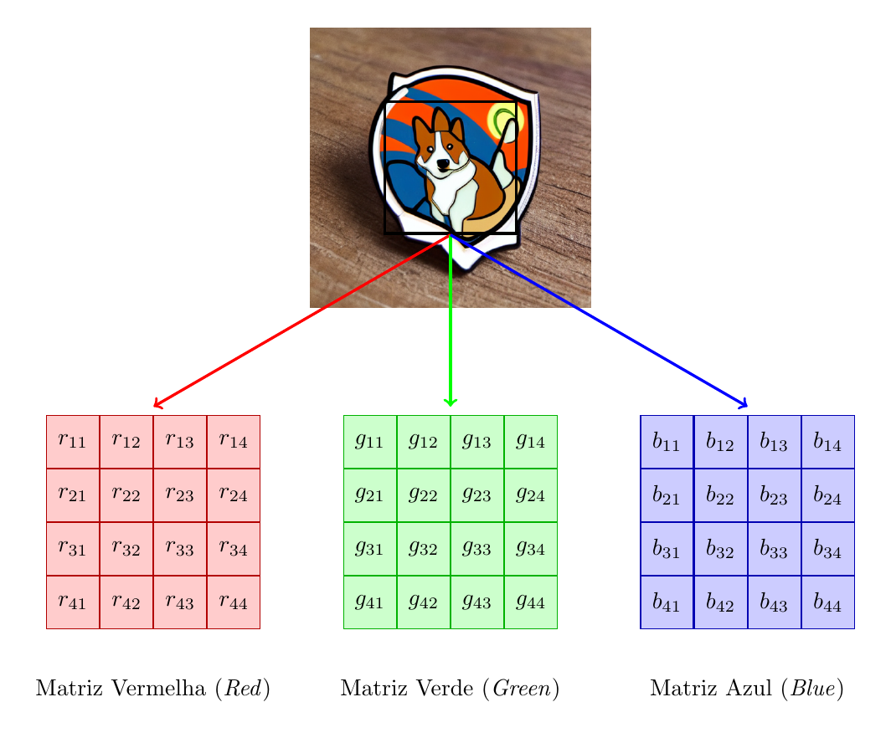
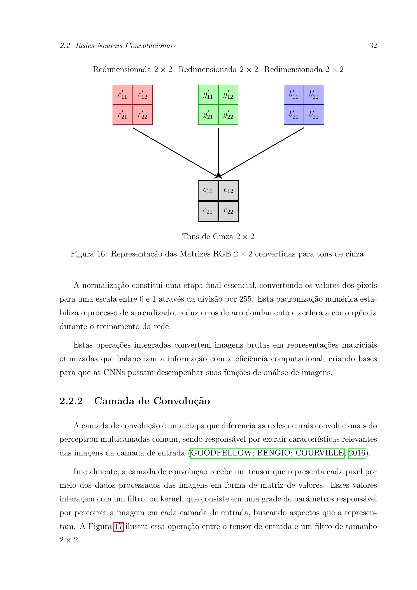
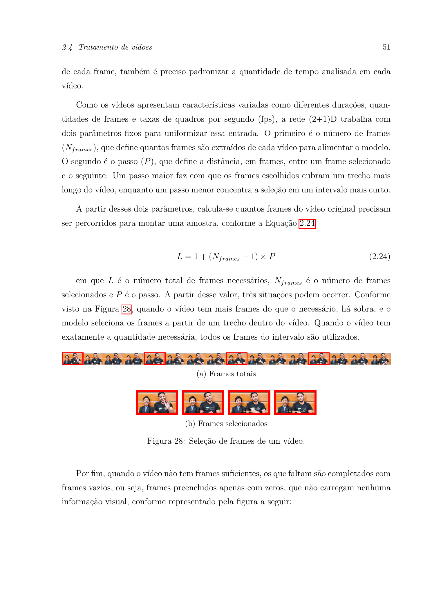
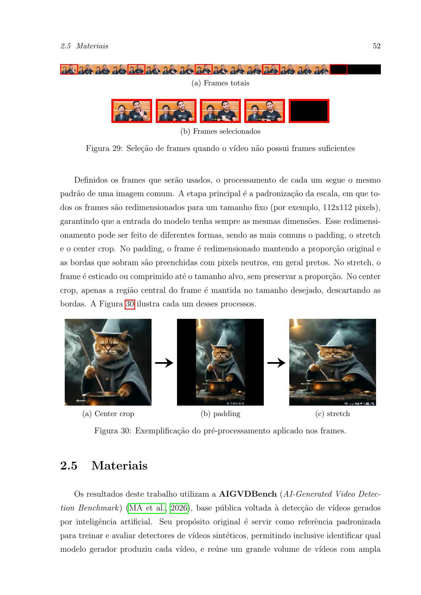
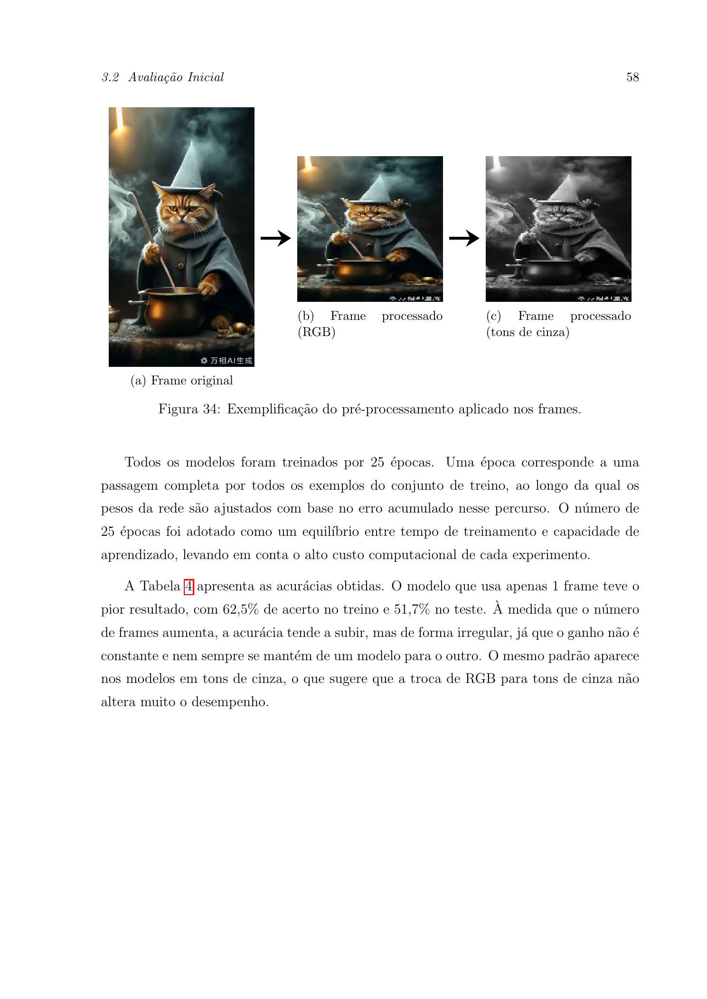
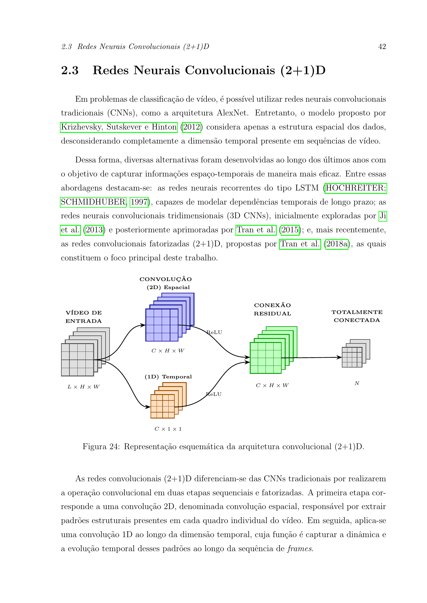
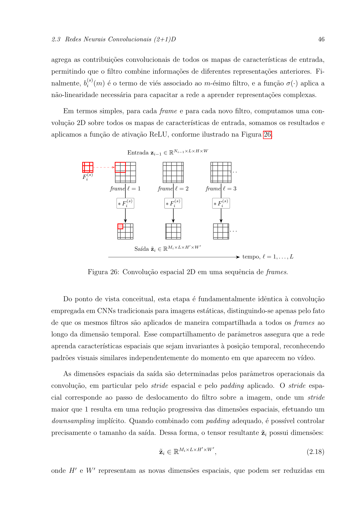
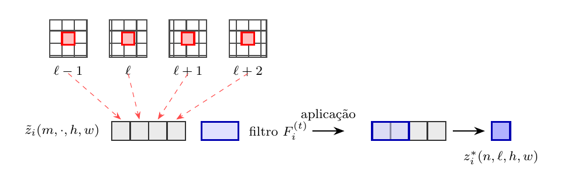

# Redes Convolucionais (2+1)D Aplicadas à Detecção de Vídeos de Inteligência Artificial

**Autor:** Matheus Jun Onishi da Silva  
**Orientador:** Prof. Dr. Douglas Rodrigues Pinto  
**Instituição:** Universidade Federal Fluminense — Departamento de Estatística  
**Curso:** Bacharelado em Estatística · 2026  

📄 [Monografia completa (PDF)](monografia_exemplo.pdf)

---

## Sumário

1. [Motivação](#-motivação)
2. [Base de Dados — AIGVDBench](#-base-de-dados--aigvdbench)
3. [Metodologia](#-metodologia)
4. [Arquitetura (2+1)D](#-arquitetura-21d)
5. [Avaliação Inicial](#-avaliação-inicial)
6. [Aprendizado por Atalho](#-aprendizado-por-atalho-shortcut-learning)
7. [Reavaliação com Amostra Filtrada](#-reavaliação-com-amostra-filtrada)
8. [Conclusões](#-conclusões)
9. [Como Usar](#-como-usar)

---

## 🎯 Motivação

Com a popularização de geradores de vídeo por IA — **Sora, Wan, EasyAnimate, AccVideo, RepVideo** — vídeos sintéticos circulam cada vez mais em contextos de desinformação política, fraude e manipulação de opinião. Estudos mostram que humanos têm grande dificuldade em identificar esses conteúdos. Este trabalho propõe o uso de **redes neurais convolucionais (2+1)D** para automatizar essa detecção.

---

## 🗄️ Base de Dados — AIGVDBench

| Característica | Valor |
|---|---|
| Total de vídeos disponíveis | +440.000 |
| Modelos geradores de IA | 31 |
| Vídeos reais (fonte) | OpenVid-HD |
| Armazenamento total | ≈ 378 GB |

**Seleção utilizada:** modelos de 2025 (Open-Sora, RepVideo, AccVideo, EasyAnimate, Wan…), ~176.000 vídeos — 162 mil de IA + 14 mil reais — classificação **binária: IA vs. Real**.

### Exemplos de frames

<table>
<tr>
<td align="center"><br/><sub>Frame de vídeo <b>real</b> (OpenVid-HD)</sub></td>
<td align="center"><br/><sub>Frame de vídeo gerado por <b>IA</b></sub></td>
</tr>
</table>

---

## ⚙️ Metodologia

### Frame como Matriz de Valores

Cada frame do vídeo é representado como uma **matriz numérica de pixels**. No modo RGB, são três canais (vermelho, verde, azul) com valores de 0 a 255; em tons de cinza, um único canal de intensidade luminosa.

<p align="center"></p>

<p align="center"></p>

### Seleção de Frames

Os vídeos são amostrados com **passo fixo P = 4** conforme a equação:

$$L = 1 + (N_{\text{frames}} - 1) \times P$$

Onde `L` é o número de frames necessários no vídeo e `N_frames` é a quantidade de frames selecionados.

**Caso 1 — vídeo com frames suficientes:** frames são selecionados em intervalos regulares.

<p align="center"></p>

**Caso 2 — vídeo com frames insuficientes:** os frames faltantes são preenchidos com **frames vazios** (zeros).

<p align="center"></p>

### Pré-processamento

Todos os frames são redimensionados para **112 × 112 px**. Foram implementados três modos — *center crop*, *padding* e *stretch* — sendo o *stretch* o utilizado nos experimentos. O exemplo abaixo mostra cada modo e a conversão para tons de cinza.

<p align="center"></p>

### Amostra Inicial (balanceada — 50% IA / 50% Real)

| Conjunto | IA | Real | Total |
|---|---|---|---|
| Treino | 1.500 | 1.500 | 3.000 |
| Validação | 500 | 500 | 1.000 |
| Teste | 700 | 700 | 1.400 |
| **Total** | **2.700** | **2.700** | **5.400** |

**Configuração dos modelos:** N° de frames de 1 a 15 · Passo P = 4 · Resolução 112 × 112 px · RGB e Tons de Cinza · 25 épocas · Adam lr = 0,01 · Google Colab GPU T4 · **30 modelos treinados**

---

## 🧠 Arquitetura (2+1)D

A arquitetura **(2+1)D fatora a convolução espaço-temporal** em duas etapas sequenciais:

<p align="center"></p>

**1. Convolução Espacial 2D** — o mesmo filtro é aplicado independentemente em cada frame, capturando padrões estruturais (bordas, texturas, formas) invariantes ao tempo:

<p align="center"></p>

**2. Convolução Temporal 1D** — para cada posição espacial fixa, o filtro desliza ao longo da dimensão temporal, capturando a evolução das características entre frames (movimento):

<p align="center"></p>

Essa fatoração reduz o custo computacional em relação às CNNs 3D completas, mantendo a capacidade de aprender padrões espaço-temporais. O modelo emprega **blocos residuais** (*skip connections*) para estabilizar o treinamento.

---

## 📊 Avaliação Inicial

### Resultados por Número de Frames

| N Frames | Treino RGB (%) | Teste RGB (%) | Tempo RGB (min) | Treino Cinza (%) | Teste Cinza (%) | Tempo Cinza (min) |
|:---:|:---:|:---:|:---:|:---:|:---:|:---:|
| 1  | 62,50 | 51,71 | 207,6 | 57,93 | 52,71 | 272,5 |
| 2  | 64,17 | 60,71 | 219,3 | 59,90 | 61,36 | 240,5 |
| 3  | 64,97 | 55,00 | 232,3 | 62,03 | 61,79 | 249,5 |
| 4  | 64,60 | 67,29 | 298,1 | 61,57 | 58,43 | 311,9 |
| 5  | 65,60 | 65,36 | 259,5 | 63,63 | 62,21 | 267,7 |
| 6  | 64,97 | 67,57 | 267,8 | 63,73 | 59,29 | 297,6 |
| 7  | 65,77 | 67,64 | 278,1 | 62,63 | 64,36 | 280,7 |
| 8  | 66,70 | 67,07 | 352,3 | 62,30 | 57,21 | 290,9 |
| 9  | 67,93 | 66,21 | 302,7 | 62,67 | 63,21 | 301,0 |
| 10 | 70,67 | 68,29 | 366,0 | 64,47 | 61,79 | 365,3 |
| 11 | 69,07 | 70,07 | 368,9 | 68,30 | 67,64 | 334,6 |
| 12 | 73,47 | 66,86 | 346,2 | 71,43 | 68,29 | 346,2 |
| 13 | 81,17 | 67,57 | 350,7 | 80,20 | 64,50 | 351,4 |
| **14** | **98,17** | **98,93** | **340,4** | **98,33** | **99,14** | **379,6** |
| **15** | **98,70** | **99,14** | **372,4** | **98,77** | **99,00** | **352,4** |

Os modelos com **14 e 15 frames** atingem ~99% de acurácia — um salto muito acima do padrão dos demais, o que levantou a hipótese de aprendizado por atalho.

---

## 🔍 Aprendizado por Atalho *(Shortcut Learning)*

A análise exploratória da **distribuição de frames por classe** revelou uma diferença estrutural crítica:

<table>
<tr>
<td align="center"><br/><sub>Conjunto de Treino</sub></td>
<td align="center"><br/><sub>Conjunto de Teste</sub></td>
</tr>
</table>

| Estatística | IA (Treino) | Real (Treino) | IA (Teste) | Real (Teste) |
|---|:---:|:---:|:---:|:---:|
| Mínimo    | 37  | 80    | 37  | 80    |
| Mediana   | 49  | 148   | 49  | 154,5 |
| 1º Quartil| 49  | 113   | 49  | 114   |
| Máximo    | 161 | 1.620 | 137 | 1.621 |

Com 14 ou 15 frames e passo 4, o modelo precisa percorrer uma janela de **53 a 57 frames**. Como a maioria dos vídeos de IA tem apenas ~49 frames (mediana), eles recebem **frames vazios** no pré-processamento — algo que não ocorre com os vídeos reais (mínimo de 80 frames). O modelo aprendeu a usar a **presença de frames vazios como atalho** para classificar IA, e não o conteúdo visual propriamente dito.

> Vale observar que, em um cenário real, esse atalho **poderia ser útil na prática**: diferenças estruturais como o menor número de frames dos vídeos de IA tendem a persistir enquanto os geradores não forem aprimorados nesse aspecto.

---

## 🔄 Reavaliação com Amostra Filtrada

Para confirmar a hipótese, foi aplicado um **limiar de ≥ 57 frames** por vídeo, eliminando os vídeos que alimentariam o atalho.

### Filtro e Nova Amostra

| Critério | Valor |
|---|---|
| Limiar mínimo | ≥ 57 frames por vídeo |
| Menor vídeo após filtro | 81 frames |
| Vídeos antes do filtro | 5.400 |
| Vídeos após o filtro | 3.744 (redução de ≈ 31%) |

| Conjunto | IA | Real | Total |
|---|---|---|---|
| Treino | 1.071 | 1.071 | 2.142 |
| Validação | 300 | 300 | 600 |
| Teste | 501 | 501 | 1.002 |
| **Total** | **1.872** | **1.872** | **3.744** |

### Distribuição de Frames — Amostra Filtrada

<table>
<tr>
<td align="center"><br/><sub>Conjunto de Treino (filtrado)</sub></td>
<td align="center"><br/><sub>Conjunto de Teste (filtrado)</sub></td>
</tr>
</table>

| Estatística | IA (Treino) | Real (Treino) | IA (Teste) | Real (Teste) |
|---|:---:|:---:|:---:|:---:|
| Mínimo    | 81  | 80    | 81  | 80    |
| Mediana   | 81  | 156   | 81  | 153   |
| 1º Quartil| 81  | 115,5 | 81  | 116   |
| Máximo    | 161 | 1.621 | 161 | 1.575 |

### Resultados com Amostra Filtrada

| N Frames | Treino RGB (%) | Teste RGB (%) | Tempo RGB (min) | Treino Cinza (%) | Teste Cinza (%) | Tempo Cinza (min) |
|:---:|:---:|:---:|:---:|:---:|:---:|:---:|
| 1  | 66,20 | 60,18 | 297,4 | 64,80 | 58,90 | 280,3 |
| 2  | 58,40 | 59,18 | 265,1 | 59,70 | 60,40 | 251,8 |
| 3  | 62,09 | 62,77 | 267,1 | 61,40 | 61,90 | 255,6 |
| 4  | 62,61 | 61,98 | 277,0 | 63,10 | 60,75 | 268,4 |
| 5  | 62,28 | 61,88 | 324,9 | 61,55 | 62,90 | 305,2 |
| 6  | 65,31 | 65,87 | 294,1 | 64,80 | 64,30 | 281,7 |
| 7  | 67,18 | 67,56 | 292,6 | 66,40 | 66,80 | 279,5 |
| 8  | 65,64 | 64,07 | 311,4 | 64,90 | 63,20 | 298,6 |
| 9  | 65,59 | 67,76 | 406,9 | 66,10 | 66,90 | 388,4 |
| 10 | 65,89 | 68,76 | 406,9 | 64,70 | 67,50 | 390,1 |
| 11 | 66,57 | 63,07 | 377,0 | 67,20 | 64,10 | 360,8 |
| 12 | 64,24 | 62,87 | 343,5 | 63,80 | 61,95 | 330,2 |
| 13 | 65,59 | 64,87 | 348,2 | 66,30 | 65,40 | 333,7 |
| **14** | **65,08** | **61,88** | **404,9** | **64,30** | **62,70** | **386,5** |
| **15** | **64,24** | **66,77** | **374,9** | **65,10** | **65,90** | **358,2** |

A queda de ~99% para ~62–67% nos modelos de 14 e 15 frames **confirma a hipótese**: o salto de acurácia anterior era produto do atalho, não de aprendizado genuíno do conteúdo visual.

---

## ✅ Conclusões

- A rede (2+1)D mostrou-se uma **alternativa promissora** para detecção de vídeos de IA, com resultados consistentemente acima do acaso mesmo após remover o atalho estrutural.
- A **acurácia alta não é garantia de aprendizado correto** — a análise exploratória da distribuição de frames foi determinante para identificar o shortcut learning e motivar a reavaliação.
- O atalho identificado **pode ser útil na prática**: a diferença estrutural no número de frames entre vídeos de IA e reais tende a persistir enquanto os geradores não forem aprimorados nesse aspecto.
- A evolução constante dos geradores tornará o problema **progressivamente mais difícil**, exigindo detectores com atualização contínua.

---

## 💻 Como Usar

### Dependências

```bash
pip install tensorflow keras opencv-python einops openpyxl matplotlib
```

### Configuração

Edite as variáveis no início de `modelo_2plus1d.py`:

```python
DATASET_DIR    = pathlib.Path('/caminho/para/dataset')
RESULTADOS_DIR = pathlib.Path('/caminho/para/resultados')
FRAME_MIN      = 1         # Primeiro modelo do loop
FRAME_MAX      = 15        # Último modelo do loop
PRETO_E_BRANCO = False     # True = tons de cinza, False = RGB
RESIZE_MODE    = "stretch" # "stretch" | "center_crop" | "pad"
```

O dataset deve seguir a estrutura:

```
dataset/
├── train/
│   ├── ai/      ← vídeos de IA
│   └── real/    ← vídeos reais
├── val/
│   ├── ai/
│   └── real/
└── test/
    ├── ai/
    └── real/
```

### Execução

```bash
python modelo_2plus1d.py
```

O script treina automaticamente um modelo para cada valor de `N_frames` entre `FRAME_MIN` e `FRAME_MAX`, salvando os pesos `.keras`, gráficos de treinamento e resultados em planilha Excel.

---

## 📁 Estrutura do Repositório

```
├── modelo_2plus1d.py         # Código principal (treinamento + avaliação)
├── monografia_exemplo.pdf    # Monografia completa
├── imagens/                  # Figuras da monografia
│   ├── IA_eleicoes.png / Metropolis_ia.png   ← motivação
│   ├── real.png / ai.png                     ← exemplos de frames
│   ├── matrizes_rgb.png / matrizes_cinza.png ← representação numérica
│   ├── selecao_frames_1.png / _2.png         ← seleção de frames
│   ├── preprocessamento.png                  ← modos de resize
│   ├── arq_2plus1d.png                       ← arquitetura (2+1)D
│   ├── conv_espacial.png / conv_temporal.png ← convoluções
│   └── boxplot_*.png                         ← análises exploratórias
└── README.md
```

---

## 📖 Citação

```bibtex
@monografia{onishi2026redes,
  author  = {Silva, Matheus Jun Onishi da},
  title   = {Redes Convolucionais (2+1)D Aplicadas à Detecção de Vídeos de Inteligência Artificial},
  school  = {Universidade Federal Fluminense},
  year    = {2026},
  address = {Niterói, RJ, Brasil},
  type    = {Monografia (Bacharelado em Estatística)}
}
```
